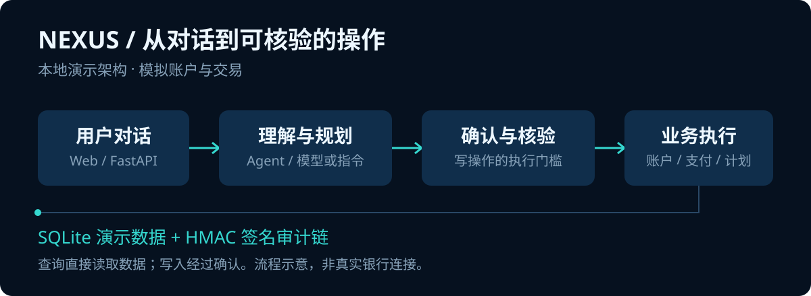

# NEXUS · AI 银行管家

<p>
  
  
  
  
</p>

**用对话串起账户查询、模拟转账与财务分析，让 AI 银行助手的完整业务流程可以在本机体验。**

NEXUS 是一个可本地部署的银行业务演示项目：从理解用户请求，到形成操作方案，再到确认、二次核验与审计记录，展示 AI 与业务服务协作的过程。无需单独部署前端、数据库或 Redis，即可运行本地演示。

> 使用模拟账户和交易数据，不连接真实银行，不执行真实资金交易。默认仅监听本机 `127.0.0.1:30000`。

[快速启动](#快速启动) · [功能](#功能) · [工作流程](#工作流程) · [模型配置](#模型配置) · [开发与测试](#开发与测试)

## 先体验一次账户查询

启动后打开 **http://127.0.0.1:30000/**，输入：

```text
查询余额
```

系统读取 SQLite 中的模拟账户并返回查询结果。当前默认关闭模型，提供确定性指令演示；启用模型后，可进一步体验自然语言意图理解。

## 功能

| 场景 | 可体验内容 |
| --- | --- |
| 账户与卡片 | 查询模拟账户、余额及卡片信息 |
| 转账与计划 | 模拟转账、定时转账和计划管理 |
| 日常收支 | 订阅管理、AA 收款、账单分析 |
| 财务规划 | 财务画像、风险评估、理财建议 |
| 对话与记忆 | 会话管理、上下文与用户记忆 |
| 操作核验 | 确认卡、二次口令验证、签名审计链 |

## 工作流程



前端通过 FastAPI 调用后端。Agent 负责理解与规划，业务服务处理账户、支付和计划等操作；涉及写入的流程通过确认与二次核验控制执行，并记录审计证据。

- **前端**：原生 HTML / CSS / JavaScript，由后端直接提供。
- **后端**：Python 3.12、FastAPI、Pydantic、SQLAlchemy。
- **Agent**：LangGraph / LangChain 编排，模型层支持 DeepSeek、OpenAI 配置。
- **存储**：SQLite + aiosqlite，首次启动自动创建演示数据。

## 快速启动

先安装 **Python 3.12**。首次启动需要联网下载依赖，启动器会自动创建本机虚拟环境及配置文件。

```sh
git clone https://github.com/jjjjjhhh1/NEXUS.git
cd NEXUS
```

### Windows

双击 `start-nexus.cmd`，或在 PowerShell 中执行：

```powershell
.\start-nexus.cmd
```

服务在后台运行；双击 `stop-nexus.cmd` 停止。

### macOS

在项目目录的终端执行：

```sh
bash start-nexus.command
```

服务在前台运行，按 **Control+C** 停止。若需要双击启动，先赋予执行权限：

```sh
chmod +x start-nexus.command nexus/start-nexus.command
```

两端均访问 **http://127.0.0.1:30000/**。未设置开机自启动。

### 修改端口

支持 `30000–65535`，请先停止原服务并选择空闲端口。

```powershell
# Windows
powershell -ExecutionPolicy Bypass -File .\start-nexus.ps1 -Port 30001
```

```sh
# macOS
bash start-nexus.command --port 30001
```

## 模型配置

首次启动默认 `NEXUS_LLM_ENABLED=false`，不需要模型密钥即可运行指令演示。需要完整 AI 对话时，在本机 `nexus/.env` 中配置：

```dotenv
NEXUS_LLM_ENABLED=true
NEXUS_LLM_PROVIDER=deepseek
NEXUS_LLM_API_KEY=your-api-key
NEXUS_LLM_BASE_URL=https://api.deepseek.com/v1
NEXUS_LLM_MODEL=deepseek-chat
```

使用 OpenAI 时，将提供商、地址与模型名称改为对应配置。保存后重启服务。模型服务可用性、费用和请求限制由所选提供商决定。

**不要提交 `.env` 或分享 API Key。** 配置示例见 [`nexus/.env.example`](nexus/.env.example)。

## 开发与测试

```text
NEXUS/
├── assets/readme/      # README 可编辑视觉资源
├── nexus/
│   ├── backend/        # API、Agent、业务服务与数据模型
│   ├── frontend/       # 网页界面
│   ├── migrations/     # 数据库迁移
│   ├── tests/          # 测试
│   ├── scripts/        # 操作员及验收工具
│   └── deploy/         # Linux 部署配置
├── run-nexus.py        # 跨平台环境初始化与前台启动
├── start-nexus.cmd     # Windows 启动入口
└── start-nexus.command # macOS 启动入口
```

安装完成后，在项目根目录执行：

```powershell
# Windows：API 回归测试
.\nexus\.venv\Scripts\python.exe -m pytest nexus/tests/test_api.py -q
```

```sh
# macOS：API 回归测试
nexus/.venv/bin/python -m pytest nexus/tests/test_api.py -q
```

本次 Windows 部署已通过 **27 项 API 测试**，并验证健康检查、会话、账户概览、消息与审计接口。macOS 启动脚本已提供，尚未完成 macOS 实机验证；这些检查不代表完整测试套件全部通过。

## 数据、日志与使用边界

| 路径 | 用途 |
| --- | --- |
| `nexus/.env` | 本机配置与模型密钥 |
| `nexus/nexus-demo.db` | 演示数据库 |
| `nexus/.runtime/audit/` | 本地审计签名密钥与锚点 |
| `nexus/.runtime/server*.log` | Windows 后台服务日志 |
| `nexus/.venv/` | 当前电脑的 Python 虚拟环境 |

迁移数据前先停止服务，将数据库和审计目录一并备份；虚拟环境应在目标电脑重新创建。审计机制用于检测数据库篡改，不防御已控制应用主机的攻击者。

本项目适合产品原型展示、业务流程验证和技术研究。理财输出属于演示内容，不能作为实际投资决策依据。需要 Linux 公网演示时，请阅读 [`部署.md`](部署.md) 中的登录门禁、HTTPS 和主机白名单配置，避免直接对外暴露本地模式。

更多操作说明见 [`跨平台使用说明.md`](跨平台使用说明.md)。仓库目前未附许可证；使用与分发前请确认授权。
